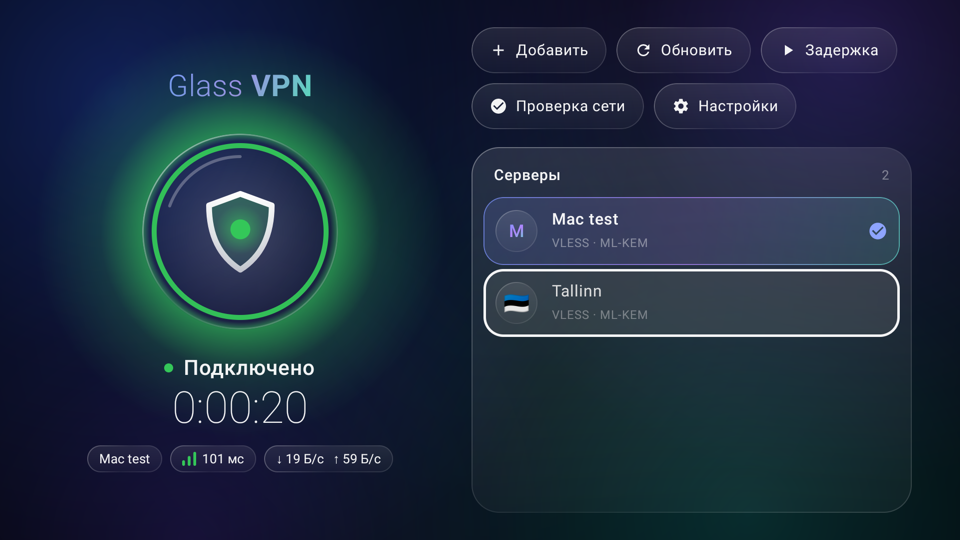
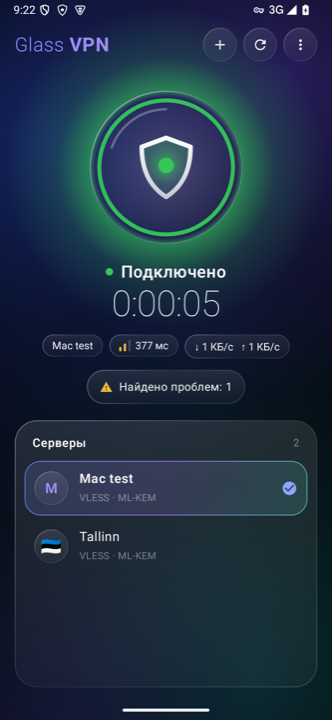
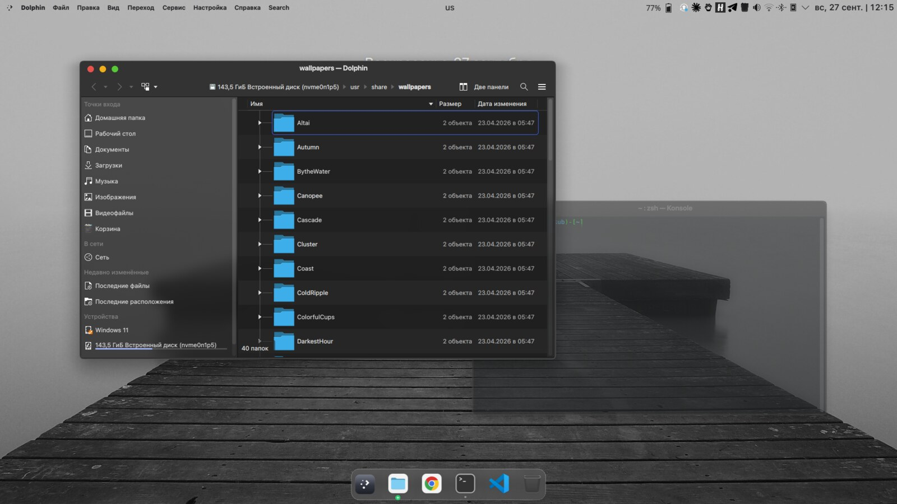
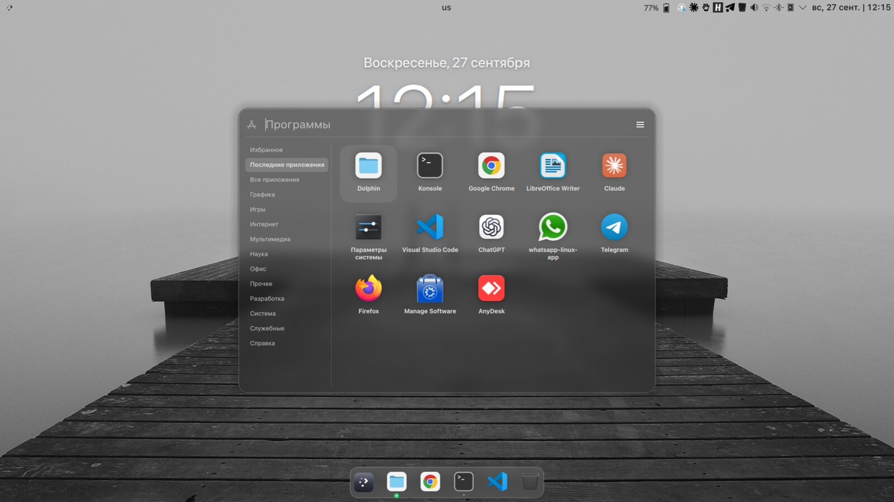
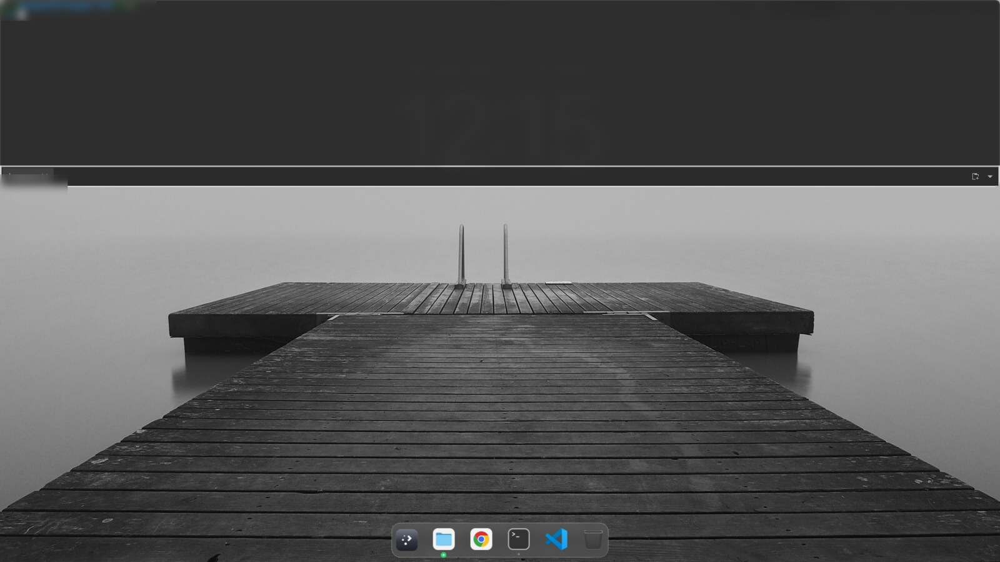

# Plasma Glass

Рабочий стол из матового стекла для KDE Plasma 6 на Kubuntu: Kubuntu со своим
лицом (значки Breeze, логотип Plasma) и эргономикой Mac — строка меню сверху, док,
жесты тачпада и выпадающий терминал.

[English version](README.md)

## 📲 Glass VPN для Android и Android TV

VPN-клиент из этого репозитория: VLESS (Reality, gRPC, XHTTP, ML-KEM), российские сайты
напрямую, остальное через VPN. Телефоны и телевизоры на Android 9 и новее.

**[⬇ Скачать для телефона](https://github.com/GrigoriyIT/plasma-glass/releases/latest/download/GlassVPN-arm64.apk)** · **[⬇ Скачать для телевизора](https://github.com/GrigoriyIT/plasma-glass/releases/latest/download/GlassVPN-armv7.apk)** · [все версии и что нового](https://github.com/GrigoriyIT/plasma-glass/releases/latest)

Ссылки всегда ведут на последнюю версию. «Для телевизора» — это сборка для 32-битных систем
(например, Xiaomi Mi TV 4S/4A); если на телефоне не ставится версия «для телефона», подойдёт она же.
Подробнее — в [описании Glass VPN](components/vpn/README.md#android).

|  |  |
|---|---|

|  |  |
|---|---|

## Что внутри

- **Матовое стекло и один контур.** У окон, диалогов и всплывающих окон одинаковое
  скругление 11 px и одна тонкая светлая линия по краю, как в macOS. Без двойных
  углов и засветов.
- **Активные и неактивные окна.** У активного окна стеклянная боковая панель и
  почти сплошная область содержимого, чтобы не отвлекало. Неактивные окна целиком
  становятся прозрачным матовым стеклом.
- **Адаптивная верхняя панель.** Полностью прозрачная; текст и монохромные значки
  сами становятся тёмными или светлыми под цвет обоев.
- **Обои с часами.** Любая картинка с крупными часами и датой по центру; часы
  перерисовываются раз в минуту и почти не нагружают систему.
- **Жесты тачпада.** Три пальца влево/вправо — переключение программ, вверх — все
  окна, вниз — окна текущей программы.
- **Выпадающий терминал.** Guake по F12 выезжает строго сверху вниз на треть экрана,
  без значка в доке и курсора загрузки.
- **Меню программ с колонкой категорий.** Все категории видны и читаются целиком.
- **Исправления, найденные по пути:** Chrome 154 портит системный кэш шрифтов, из-за
  чего падает Plasma; меню загрузки из двух пунктов, Kubuntu и Windows.

## Состояние

Экспериментальный проект. Собран и настроен на одном ноутбуке: Kubuntu 26.04,
Plasma 6.6.6 (Wayland), экран 1920×1080 без масштабирования.

Единого установщика пока нет: компоненты ставятся по одному, см.
[docs/INSTALL.md](docs/INSTALL.md). Два компонента собираются под установленную
версию KWin (исправленный эффект стекла и плагин жестов), и их нужно пересобирать
после обновления KWin.

Подробности по каждой настройке — в [docs/TUNING.md](docs/TUNING.md), типовые
проблемы — в [docs/TROUBLESHOOTING.md](docs/TROUBLESHOOTING.md).

## Лицензия и товарные знаки

GPL-3.0-or-later, см. [LICENSE](LICENSE). Сторонние проекты, на которых всё
построено, перечислены в [CREDITS.md](CREDITS.md).

Проект не связан с Apple, Canonical и KDE e.V. «Kubuntu» — товарный знак
Canonical Ltd., «macOS» — товарный знак Apple Inc. Шрифтов, логотипов и графики
Apple в репозитории нет. Установщик MacTahoe может скачать шрифты SF Pro: их
лицензия разрешает использование только на платформах Apple, поэтому систему с ними
нельзя распространять.
