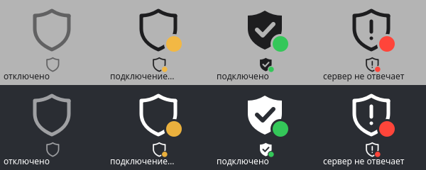

# Glass VPN

A small tray client for VLESS subscriptions: [Xray-core](https://github.com/XTLS/Xray-core) talks VLESS
(including VLESS Encryption `mlkem768x25519plus`, Reality, gRPC, XHTTP) and exposes SOCKS5 on
127.0.0.1; [sing-box](https://github.com/SagerNet/sing-box) owns the system-wide TUN and the routing.

- Blocked resources go through the VPN; the local network and Russian sites
  (`.ru`, `.рф`, `.su`, sing-geosite `category-ru`, sing-geoip `ru`) go direct.
- System-wide TUN mode (IPv4; networks here usually have no IPv6). sing-box gets `cap_net_admin` via `setcap`, so nothing runs as root.
- Gateways of NetworkManager VPN connections (e.g. a PPTP link home) bypass the tunnel.
- Subscriptions: plain or base64 lists of `vless://` links; transports tcp, grpc, ws,
  httpupgrade, xhttp; security none, tls, reality; VLESS Encryption.
- Tray icon drawn at runtime: a shield in the adaptive top bar's text colour plus a status dot —
  no dot = off, pulsing amber = connecting, green = the tunnel works (a site is opened through
  Xray every 2 s), red = the server doesn't answer. Tooltip: server, latency, ↓/↑ speed.
  Click to connect/disconnect; server list with a TCP latency test; reconnects if a core exits.

  

Files: settings and servers in `~/.config/glassvpn/` (mode 600), sing-box config and log
in `~/.local/state/glassvpn/`.

```bash
components/vpn/install.sh
```

`install.sh` also installs a polkit rule (`50-glassvpn-resolved.rules`): sing-box sets the
DNS of its TUN link through systemd-resolved on every connect and reverts it on disconnect,
and without the rule each of those calls asks for the password. It allows only resolved's
per-link DNS actions, only for local active sessions of users in the `sudo` group.

## macOS

```bash
components/vpn/macos/install.sh
```

Same client, menu bar icon instead of the tray. macOS has no file capabilities, so sing-box runs as
root through `macos/glassvpn-helper` (in `/opt/glassvpn`, root-owned; a sudoers rule allows only
`start <config>` and `stop`). The helper accepts only the config shape the client generates, forces
log/cache paths, and points the system DNS at the tunnel while it is up, restoring it on stop (and at
boot via `local.glassvpn.cleanup`). Settings in `~/Library/Application Support/GlassVPN`, logs in
`~/Library/Logs/GlassVPN`. `macos/switch-test.sh` moves a Mac from another VPN to Glass VPN with an
automatic rollback; `macos/make-icon.py` draws the app icon.

The app bundle's executable is a copy of the Python launcher (script passed via `LSEnvironment` and
`sitecustomize.py`): macOS 26 silently drops the menu bar item of an app whose executable is a shell
script that execs Python.

## Android

```bash
cd components/vpn/android
./fetch-libs.sh                 # Xray (libv2ray.aar) and hev-socks5-tunnel, pinned + sha256
./gradlew assembleRelease       # app/build/outputs/apk/release/app-arm64-v8a-release.apk
```

Same routing as the desktop client, on Android's `VpnService` (Android 10+):
TUN → [hev-socks5-tunnel](https://github.com/heiher/hev-socks5-tunnel) → SOCKS5 on 127.0.0.1 →
Xray in-process ([AndroidLibXrayLite](https://github.com/2dust/AndroidLibXrayLite)) → VLESS.

- Russian sites (`.ru`, `.рф`, `.su`, `geosite:category-ru`, `geoip:ru`) and the LAN go direct.
- DNS: hev answers every query with an address from 198.19.0.0/16 and hands Xray the name, so
  routing is by domain and blocked names are resolved on the server side. Direct names are resolved
  through the physical network's DNS server (Go has no system resolver on Android); Xray restarts
  with the new one when the network changes.
- The app is excluded from its own VPN, so Xray reaches the server without looping.
- The local SOCKS5 port is random and password-protected for each connection: some apps look for
  open local proxies to detect a VPN.
- IPv4 only: no IPv6 route is added, so Android blocks IPv6 for tunnelled apps rather than leaking it.
- Shield button with the same status colours as the tray icon; the live check fetches
  `generate_204` through Xray every 4 s while the screen is on. Speed and latency in the notification.
- Quick Settings tile; "Always-on VPN" and "Block connections without VPN" in the system settings work.
- Settings: connect when the app opens, connect after boot (and after an app update if the tunnel
  was on), and apps that bypass the tunnel: the system routes them, DNS included, outside the VPN
  (with "Block connections without VPN" they get no network at all). Time connected on the main
  screen and as a chronometer in the notification.
- Keeps itself running: a sticky foreground service that comes back if the system kills it, and a
  watchdog that restarts Xray (re-resolving the server) when it stops or the server has been silent
  for 30 s, backing off up to 5 min.
- Network check (menu, or the "problems found" chip on the main screen): lists other VPN apps
  (found by their `BIND_VPN_SERVICE` service, hence `QUERY_ALL_PACKAGES` — fine outside Google Play)
  and checks internet / captive portal, another active VPN, a fixed Private DNS server (bypasses the
  mapped DNS, so routing falls back to IPs), a leftover proxy, battery optimisation, Data Saver and
  notifications. Android doesn't let an app uninstall others or change these settings, so each item
  opens the system uninstall dialog or the right settings screen ("Remove all" chains the dialogs);
  for a full network reset it opens Settings and says where the reset is.

A release key goes in `keystore.properties` (not committed): `storeFile`, `storePassword`,
`keyAlias`, `keyPassword`. Without it the release APK is unsigned; `assembleDebug` signs with the
debug key.
